## Table of Contents

[Research Topic](#Research-Topic)

[1. Executive Summary](#Chapter-1-Executive-Summary)

[2. Literature Review](#Chapter-2-Literature-Review)

[3. ETL Diagram](#Chapter-3-Data-Source-and-ETL-Flow)

[4. Data Analysis](#Chapter-4-Data-Analysis)

[4.1 Understanding the Data](#41-Understanding-the-Data)

[4.2 Exploratory Data Analysis](#42-Exploratory-Data-Analysis)

[4.3 Exploratory Data Analysis Conclusions](#43-Concluding-Exploratory-Data-Analysis)

[4.4 Binary Classification Models](#43-Binary-Classification-Methods)

[5. Conclusion](#Chapter-5-Conclusion)

[Bibliography](#Bibliography)

## Research Topic

The project aims to enhance the early identification of individuals at risk for Alzheimer's Disease by developing a machine-learning model created using the random forest classifier, with a diagnosis prediction accuracy score of 91%. Through exploratory data analysis (EDA) conducted on a public dataset from the Kaggle platform, we have identified the key features of early prediction of Alzheimer's Disease such as functional assessment score, mini-mental state examination score (MMSE), memory complaints, behavioural problems and activities of daily living score (ADL). The insights derived from the model potentially can support organizations such as Alzheimer Research UK in proactively identifying at-risk individuals and facilitating appropriate interventions.

## Chapter 1 Executive Summary
This project represents a significant step towards leveraging machine learning for proactive healthcare. 
This project has used the Random Forest Classifier to predict the likelihood of an individual developing Alzheimer's Disease in the future. Alzheimer's Disease is a progressive neurological disorder that impacts memory, thinking, and behaviour, and early prediction is crucial for intervention and management strategies. 

The model accuracy score is 91%, indicating that 91% of the total instances are correctly classified.

For future iterations aim to apply k-fold cross-validation and Grid Search techniques avoiding overfitting issues. Advanced ensemble boosting methods can also be combined with Random Forest to create a more robust model.

## Chapter 2 Literature Review

### 2.1 Machine Learning Algorithms
Machine learning (ML) algorithms are computational methods that enable machines to learn from data and make decisions or predictions based on that data. “A system that is in a changing environment should have the ability to learn” (Alpaydin, 2021). 

Hence machine learning is a form of artificial intelligence that evolves with learning outcomes.

Ensemble learning is one of the key supervised machine learning categories and “is primarily used to improve the performance of a model” (Mahesh, 2020). Within Ensembles gradient-boosting and random forest classification are two famous methods.

### 2.2 Why Random Forest Classifier
“Prediction in health sector requires greater degree of precision for improved diagnosis and treatment” (Singh et al., 2017)
Azar et al. 2014 claim that “random forest models provided greater predictive accuracy than single-tree models” and are specifically effective in healthcare.
Jackins et al. (2021) discuss that “Bayesian network classifier and random forest classifier are used to diagnose the risk for diabetes.. the outcome shows that Random Forest was performed well in both accuracy and ROC curve”.

Furthermore, “Standard decision tree classifiers have the disadvantage that they are prone to overfitting to the training set. The random forest's ensemble design allows the random forest to compensate for this and generalize well to unseen data” (Wood, n.d.).
Prediction power and model accuracy are the key measures in choosing an algorithm for the selected data set. Hence the random forest (RF) method has been identified as the optimal approach to predicting the machine learning outcome for Alzheimer's Disease.

## Chapter 3 Data Source and ELT Flow

### ELT Diagram
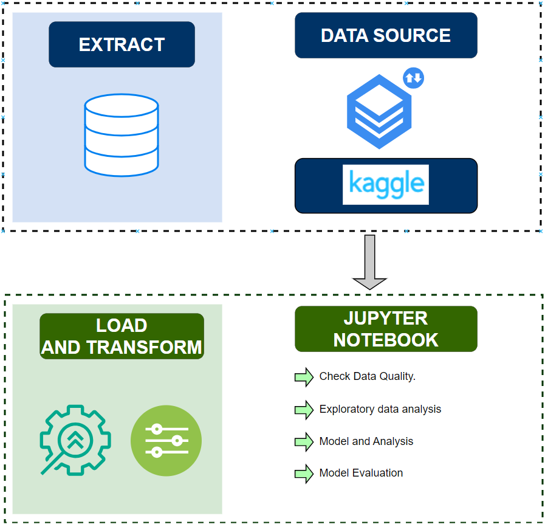

Above Extract, Load and Transformation (ELT) diagram outlines the data flow from the source to the final analytical and model-building phase. Below are the various stages involved. 

#### Extraction:

The Alzheimer's Disease Dataset (Kharoua, 2024) is sourced from the Kaggle platform, downloaded in CSV file format and saved on a local drive.

#### Load:

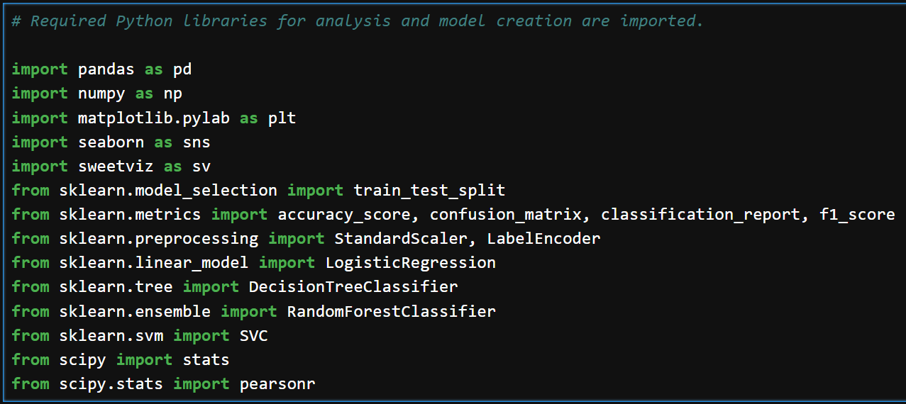

The CSV data is subsequently imported into a Jupyter Notebook using a pandas DataFrame for further analysis and evaluation.

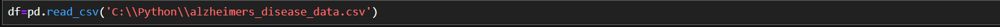

#### Transformation:

This is where the data analysis, transformation and modelling are carried out, including data quality checks, Exploratory Data Analysis (EDA), data drop, model building and evaluation.

## Chapter 4 Data Analysis

### 4.1 Understanding the Data

Before diving into data analysis or model building, it’s essential to understand our dataset. 

We have applied below exploratory steps to gain an understanding of the data's structure, the types of variables, and any issues that might need to be addressed

* shape - structure of data (rows, columns)
* head - reading the data (first 25 rows)
* dtypes - data type of each column
* describe - key statistics of each column
* isnull - checking for null values (completeness data dimension)

=========================================================================================

#### Shape of Data

* The attribute shape from the pandas library is used to get the dimensions (number of rows and columns) of the DataFrame. The data set contains 35 columns and 2,149 rows.

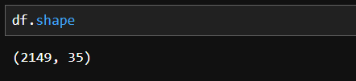

#### Head - Previewing the Data

* The head() function is also from the pandas library is used to display the first 15 rows of a DataFrame, allowing us to evaluate if the right data type is available for analysis.
  
* Also, help us to spot if there are any glaring issues, such as missing headers or unexpected values.

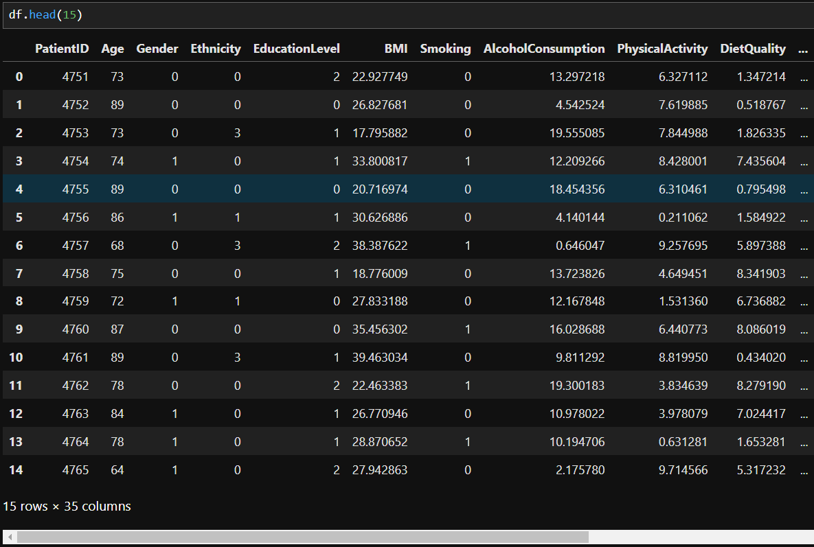

##### Privacy Considerations:

This dataset contains personally identifiable information (PII). Complying with Art. 7 of the GDPR “the controller shall be able to demonstrate that the data subject has consented to processing of his or her personal data” (Intersoft Consulting, 2016).

However, this is a publicly available dummy data source used only to express learning outcomes. Hence data privacy conformity is not within the scope.

#### Checking Data Types of Each Column

* Using the df.dtypes attribute returns a Series with the data type of each column in the DataFrame.

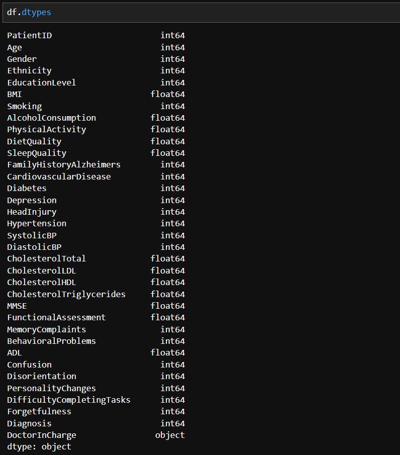

 - This helps in identifying potential issues such as mixed data types in a single column, which is crucial for data analysis and preprocessing tasks.
 - Also, verify the data has been read correctly and that each column is of the expected type.
 - No data cleaning such as formatting data types is not necessary by observing the data types.

#### Key Statistics of Each Column

* ‘Describe’ function within the pandas' data frame “Displays the Descriptive Summary Statistics of the data when invoked” (Venkataramanan, 2021).
* np.transpose() function, imported from the NumPy library, is used to transpose the rows and columns of a matrix. incorporating with the output of df.describe() function, swaps the rows and columns, effectively rotating the descriptive statistics DataFrame.
* These summary statistics help us to evaluate any outliers that may exist within the data.

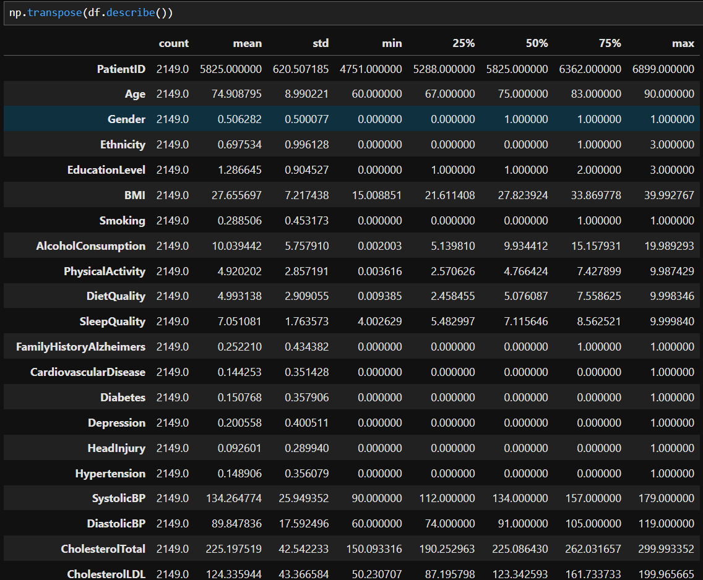
  
#### Key Observations:

##### Patient Demographics:
* Age distribution is skewed towards older individuals (mean age around 75 years).
* Gender distribution is roughly balanced.

##### Health Indicators:
* Average BMI suggests a population with a range from normal to overweight/obese.
* Relatively low prevalence of smoking and physical activity.

##### Lifestyle Factors:
* Alcohol consumption and diet quality show wide variability.

##### Health Conditions:
* Low prevalence of chronic conditions like cardiovascular disease, diabetes, hypertension, and depression.

##### Blood Pressure and Cholesterol:
* Average blood pressure and cholesterol levels are within typical ranges but show substantial variation.

These statistical summaries provide insights into the dataset's composition, outliers and variability, helpful for further analysis or modeling.

#### Checking for Null Values (Completeness Data Dimension)

* We have applied the isnull () function verifying the ‘Completeness’ data quality dimension, as “missing data will have an impact on its use and affect the reliability of insights” (GOV.UK, 2021).

### 4.2 Exploratory Data Analysis

The next stage of this analysis is to delve into comprehensive data patterns and relationships associated with the data.

Mendlem, S. (2023) claims that “Exploratory Data Analysis (EDA) serves as the compass that guides data scientists through the intricate terrain of datasets”. 

=========================================================================================

#### Check for Duplicates

* Identify and remove any duplicate entries in the dataset to ensure data quality and accuracy.

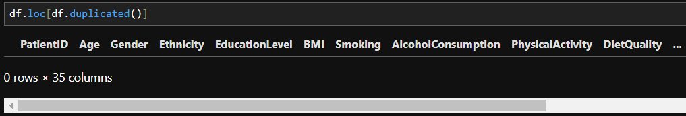

#### Data Drop (Irrelevant Columns)

* We have used a subsetted data frame to drop non-essential columns and assign them to a new data frame. This provides code clarity for future maintenance and streamline the dataset to focus on relevant features.

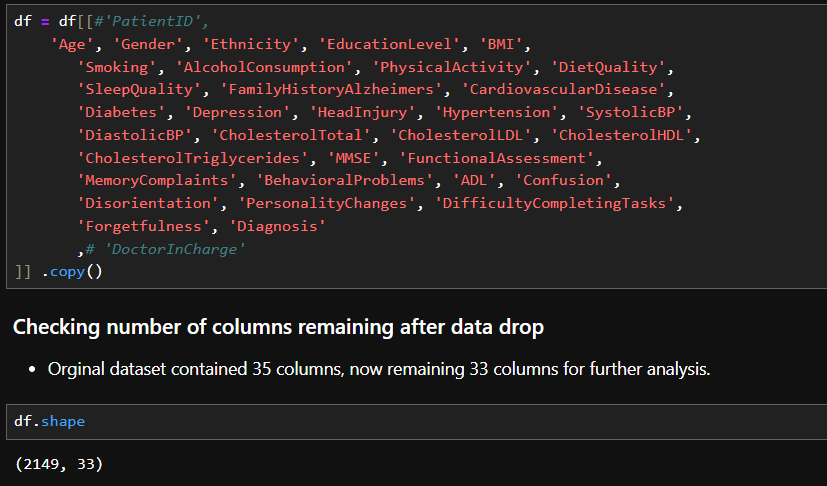

#### Quick EDA with Sweetviz

* Emerging open-source EDA libraries like ‘Sweetviz’ allow us to gain quick insights about data with minimal code. This will add "the edge to efficiency of your industrial ML and data analytics projects” (Vyshnya 2020).
  
* In contrast, when analyzing large datasets “readability and interpretation of the association graph becomes difficult” (Lekhwar 2020).

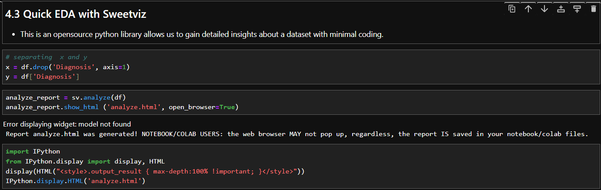

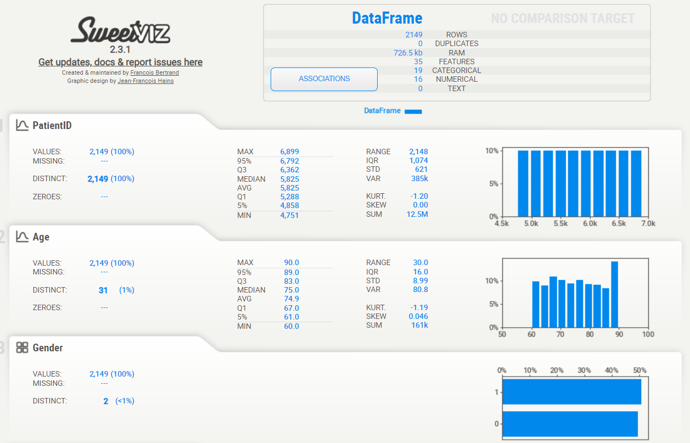

* Immediately, we can see there are no duplicates in our dataset. 19 columns are categorical and 16 are numerical.

* The Association Matrix below explains the numerical correlations. Functional Assessment and ADL briefly show a strong correlation. We’ll verify this with Seaborn Heatmap at a later stage.

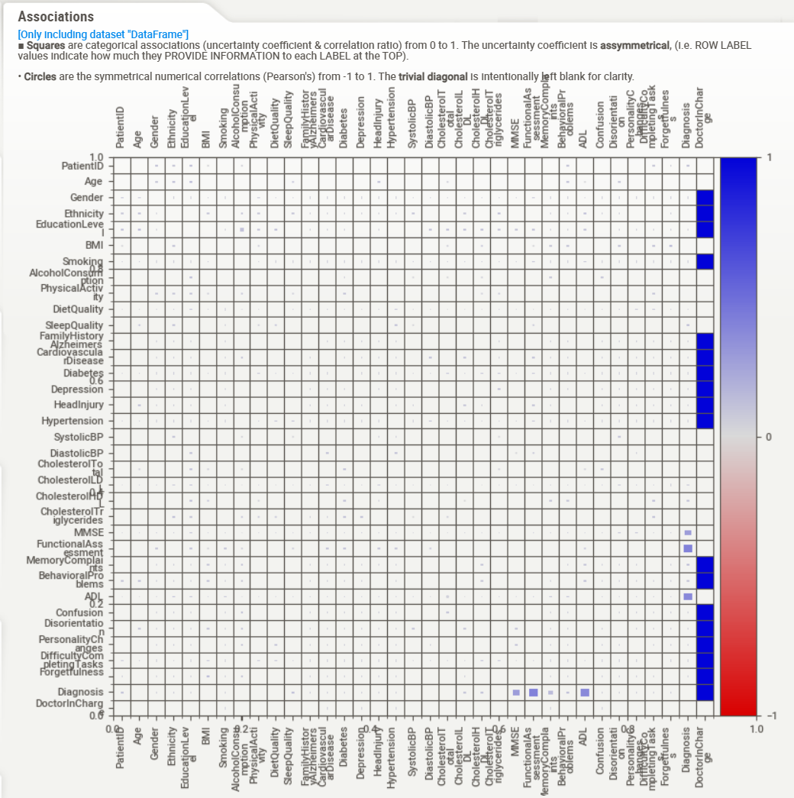

#### Plot the Distribution of Numerical Features

* Below code configures the plot style with Seaborn library, creates histograms for all columns in the DataFrame (df) with specified aesthetics, adjusts the layout to prevent overlap, and finally displays the plot.

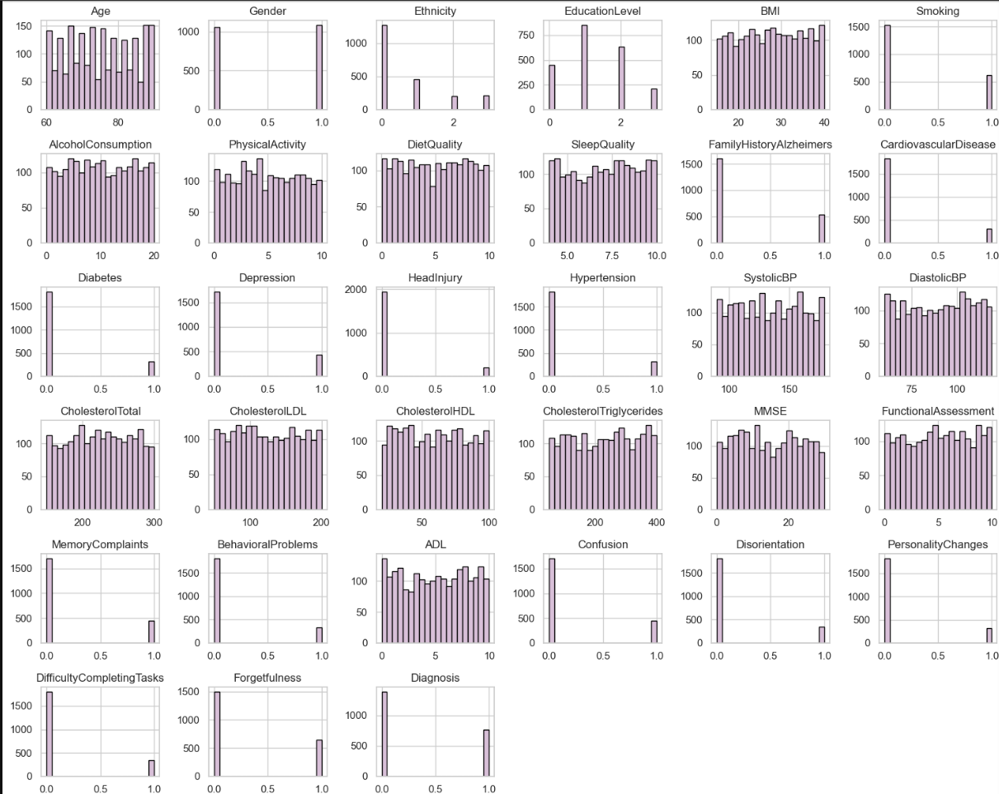

##### The insights derived from the histograms provide the following key statistics on the distribution.

•	Functional Assessment Score – range of scores indicates the variability among individuals. This allows the machine-learning model to learn the traces between different levels of functional deficiencies. 

•	MMSE Score – follows a uniform distribution between 10 and 30. This helps build a model that can distinguish between different levels of mental function.

•	Memory Complaints – most individuals do not report memory losses. A niche group with complaints can help the model identify early signs of Alzheimer's by relying on other subtle features.

Overall, the distribution and variability of features explain a comprehensive and diverse dataset. This could in turn develop a predictive model with high accuracy level.

#### Identifying Key Features for Diagnosis

* Determining which features are most relevant and influential in diagnosing conditions or predicting outcomes is key to improve model performance and interpretability.
* Hence we have applied a heatmap of the correlation matrix of the dataFrame using the Seaborn and Matplotlib libraries.

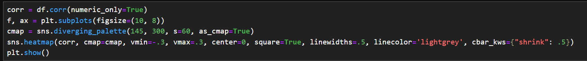

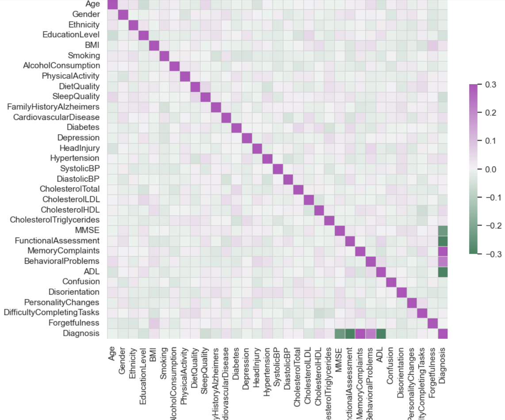

##### Key takeaways from the correlation matrix that help with the diagnosis.

The colour intensity indicates the strength  and direction of the correlations between pairs of variables.

##### Notable Positive Correlations
* ADL - Activities of Daily Living Score & Functional Asssessment Score:
  
  The dark greenish sqaures represnts a stronger correlation  between these variables.
  
  Consistent monitoring of these metrics can identify early cognitive decline, which could progress to Alzheimer's.
    
* Memory Complaints & MMSE - Mini-Mental State Examination Score:
  
  Mild correlation is present indicated by darker shades.
  
  By promoting individuals to report any memory concerns can also help with early diagnosis.
  
* Behavioral Problems:
  
  It is recommended to observe changes in behaviour given the positive correlation.
  
  Early identification can lead to further evaluation and intervention.

##### Notable Negative Correlations
Negative correlated variabled such as education level, BMI & sleep quality act as protective measures
against risk of the disease.

Many cells with very light shades or almost white represents weak or no correlation.

#### Univariate Analysis

* Performing a detailed analysis of individual variables allow us to understand its distribution, central tendency, variability, and potential impact on the target variable.

* Frequency of age distribution is illustrated using seaborn barplot.

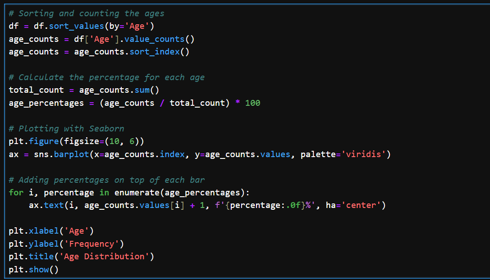

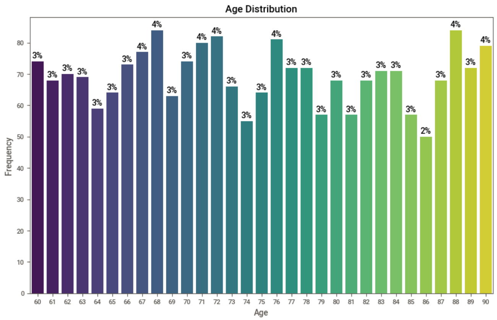

 - Age distribution range from 60 to 90 years.
 - The distribution shows a fairly uniform spread across the age range, with slight peaks at ages 74-76 and 89-90.
 - This suggests that the dataset has a consistent representation of individuals in this age group, with few significant outliers.

* Gender Distribution is also represented using seaborn barplot.

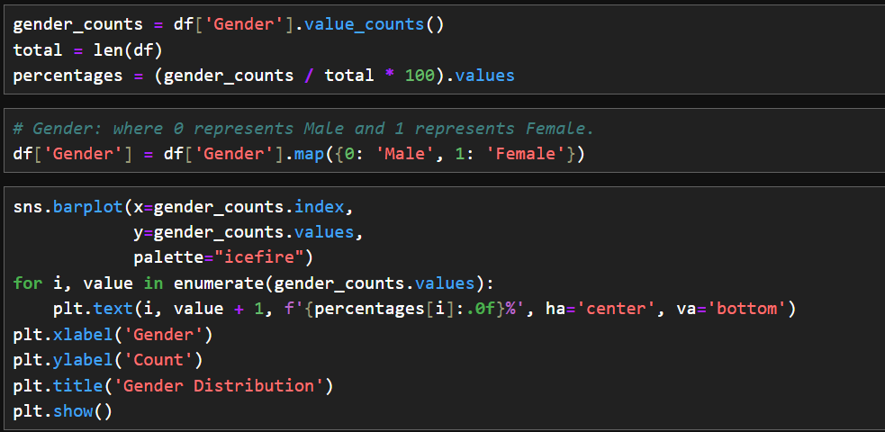

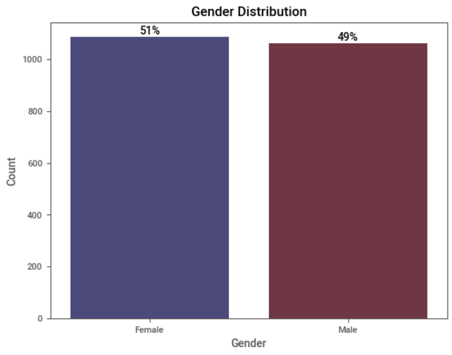

 - Both genders are equally distributed.
  
* Following these steps sets the grounds in understanding the dataset thoroughly before moving on to more complex analyses or model building.

*Diagnosed Cases by Ethnicity Groups

 - This step help us to evaluate whether a certain ethnic group is prone to Alzheimer's

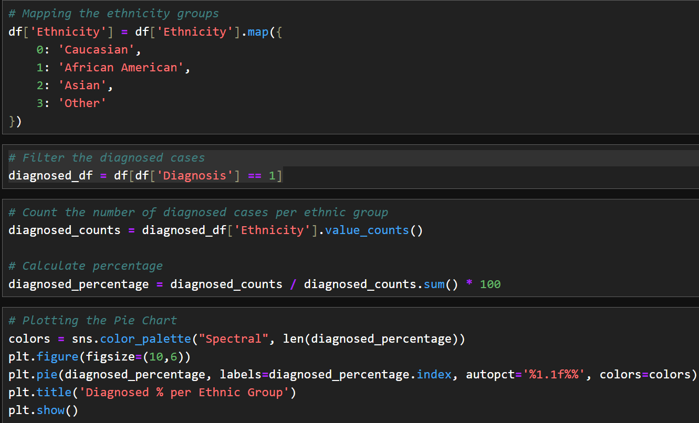

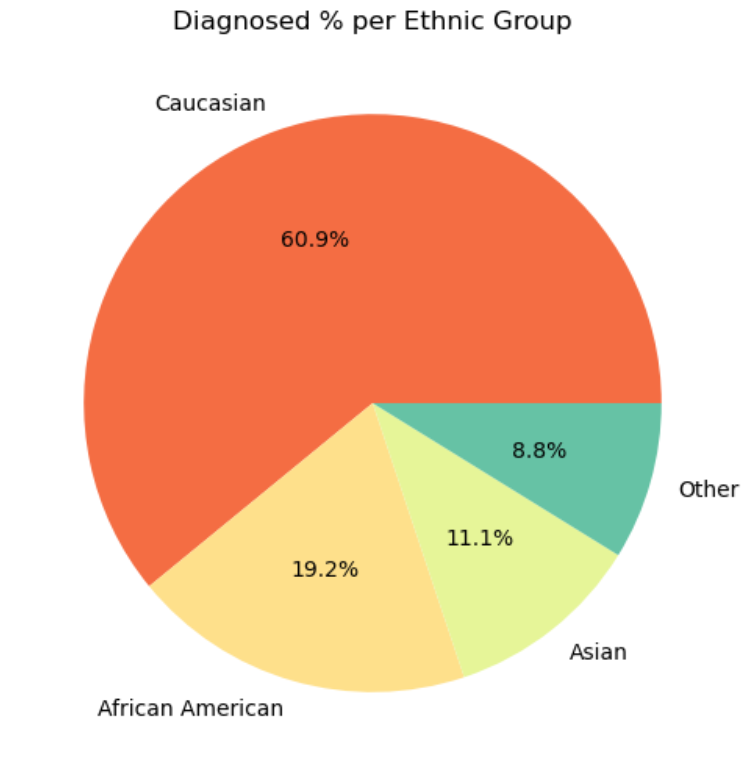

 - As per the illustration 61% of the diagnosed cases reported within Caucasian Ethnic Group.
 - Second largest ethnic group represented by African Americans, which is 19%
 - Overall, The data indicates a significant disparity in diagnosis rates across different ethnic groups.
 - This disparity may be due to various factors, including differences in access to healthcare, socioeconomic status and genetics.
 - Further investigation would be necessary to fully understand the reasons behind these differences.

### 4.3 Concluding Exploratory Data Analysis

#### Dataset Characteristics

 - Choosen dataset of this project is fairy small with 2,149 records of individuals and 33 useful features. (Excluding PatientID & DoctorInCharge)
 - Data cleaning was deemed unnecessary as there are no missing values, duplicate records, or formatting errors present.
 - Non-binary features need to be scaled before modeling to ensure they contribute equally to the analysis.

#### Health profile observations

 - The patient population is predominantly elderly, with a roughly equal gender distribution
 - Despite the advanced age of the group, there is a relatively low prevalence of chronic conditions like cardiovascular disease, diabetes, hypertension, and depression.
 - Blood pressure readings show variability, with some individuals displaying higher readings, but the overall distribution remains within typical ranges.
 - Analysing the diagnosed cases by Ethnicity, 61% represents Caucasian Ethnic Group.
 - This could potentially be subject to the limited dataset. However, require further invesgation.
 - Also, 40% of the diagnosed population only had High School level education.
 - It is evident that higher the education level, less likely the risk of disease.

   

### 4.4 Binary Classification Methods

#### Features and Target Split

We are defining model features and target variable with below step. In summary, we are seperating the original dataset (df) into two parts.
 * features - all the columns except the 'Diagnosis' column.
 * target - contains only the values from the 'Diagnosis' column.

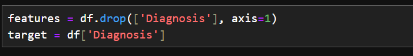

#### Standardizing features

Scaling features to have a mean of 0 and a standard deviation of 1.
Ensure that each feature contributes equally to a algorythm and improves the convergence speed and accuracy of the model.

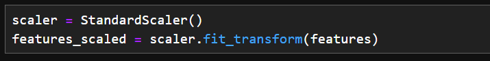

#### Test and Train Data Split

30% of the data will be used for testing, and the remaining 70% will be used for training

#### Method 01: Logistic Regression

A logistic regression model is created and trained using the train data created earlier. The model is then promoted to predict the labels for the test dataset.

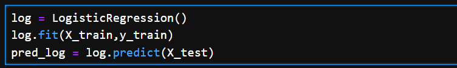

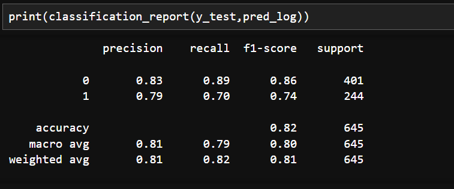

* Logistic Regression Accuracy Score = 82%

#### Method 02: Random Forest Classifier

We are now deploying random forest classifier method which combines multiple decision trees to improve classification accuracy and robustness.

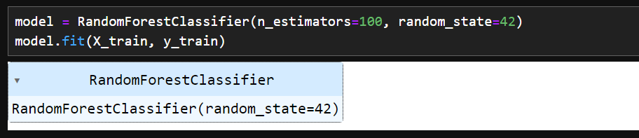

By setting the 'random state' we can ensure that the same results are achieved at each time code is run.

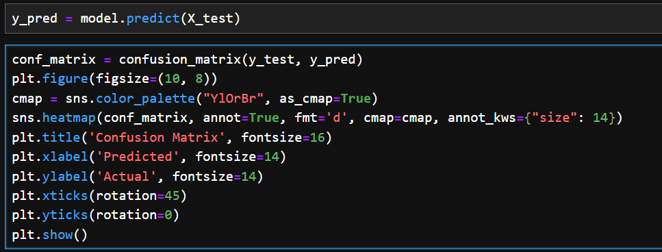

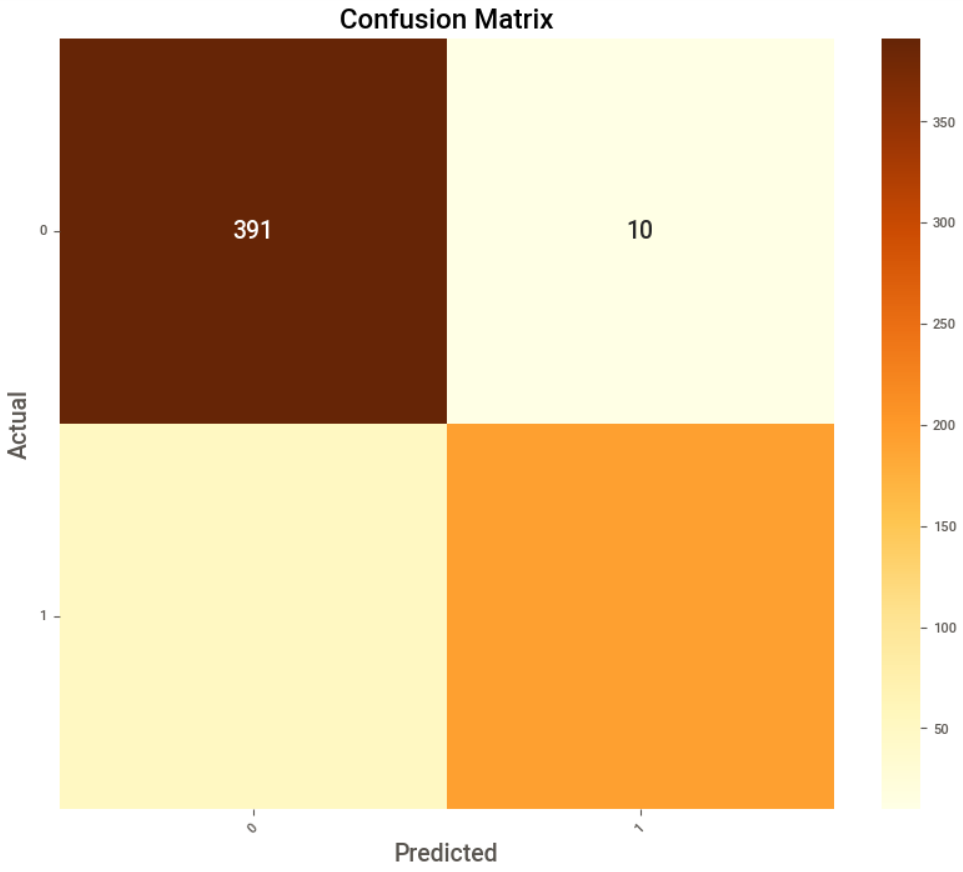

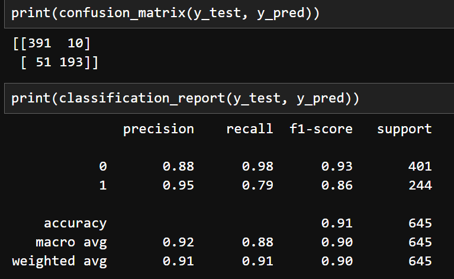

  - Random Forest Classifier Accuracy Score = 91%, indicating that 91% of the total instances are correctly classified.
  - Precision vs. Recall: For class 0 (negative), recall is very high (0.98), meaning most actual true negative instances are identified, but precision is slightly lower (0.88). For class 1 (positive), precision     is       very high (0.95), but recall is significantly lower (0.79), indicating that while most predictions of true positives are correct, a notable portion of actual true positive instances are missed.
  - The F1-scores reflect a good balance between precision and recall, but the lower F1-score for positives (0.86) suggests the model could benefit from improvements in recall for positive instances.
  - Overall, the Random Forest classifier shows strong performance, particularly in terms of accuracy and precision.

## Chapter 5: Conclusion

Even though model accuracy is 91%, I have identified below techniques that could further improve model performance.

Advanced ensemble methods such as Gradient Boosting and XGBoost could be combined with Random Forest to create a more robust model. Research by González-Recio et al. (2013) explains Gradient Boosting “showed similar or higher accuracy than other methods, such as Bayes A or Bayesian LASSO”

“A model that would just repeat the labels of the samples that it has just seen would have a perfect score but would fail to predict anything useful on yet-unseen data.” (scikit-learn.org, n.d.). Hence with upskilling my Python skills, I aim to adopt k-fold cross-validation to ensure the model's performance is consistent across different data subsets and Grid Search to find the optimal parameters.

## Bibliography

Alpaydin, E., 2021. Machine learning. MIT press.

Azar, A.T., Elshazly, H.I., Hassanien, A.E. and Elkorany, A.M., 2014. A random forest classifier for lymph diseases. Computer methods and programs in biomedicine, 113(2), pp.465-473.

González-Recio, O., Jiménez-Montero, J.A. and Alenda, R., 2013. The gradient boosting algorithm and random boosting for genome-assisted evaluation in large data sets. Journal of dairy science, 96(1), pp.614-624.

GOV.UK, 2021. Meet the data quality dimensions [online] Available at: https://www.gov.uk/government/news/meet-the-data-quality-dimensions [Accessed 05 July 2024]

Intersoft Consulting, 2016.GDPR [online] Available at: https://gdpr-info.eu/art-7-gdpr/ [Accessed 07 July 2024]

Jackins, V., Vimal, S., Kaliappan, M. and Lee, M.Y., 2021. AI-based smart prediction of clinical disease using random forest classifier and Naive Bayes. The Journal of Supercomputing, 77(5), pp.5198-5219.

Kharoua, R.E., 2024. Alzheimer's Disease Dataset. [online] Available at: https://www.kaggle.com/datasets/rabieelkharoua/alzheimers-disease-dataset/discussion/513158 [Accessed 01 July 2024]

Lekhwar, S., 2020. Sweetviz: Exploratory Data Analysis made sweet. [online]. Available at: https://medium.com/@shubhamlekhwar/sweetviz-exploratory-data-analysis-made-sweet-21309de6973 [Accessed 07 July 2024]

Mahesh, B., 2020. Machine learning algorithms-a review. International Journal of Science and Research (IJSR).[Internet], 9(1), pp.381-386.

Mandlem, S., 2023. The Vital Role of Exploratory Data Analysis (EDA) in Data Science [online]. Medium. Last updated: 18 December 2023. Available at: https://medium.com/@satya.sujji123/the-vital-role-of-exploratory-data-analysis-eda-in-data-science-23bc5a706358 [Accessed 05 July 2024]

Scikit-learn.org, n.d. 3.1. Cross-validation: evaluating estimator performance [online] Available at: https://scikit-learn.org/stable/modules/cross_validation.html [Accessed 09 July 2024]

Singh, A., Halgamuge, M.N. and Lakshmiganthan, R., 2017. Impact of different data types on classifier performance of random forest, naive bayes, and k-nearest neighbors algorithms. International Journal of Advanced Computer Science and Applications, 8(12).

Venkataramanan, M., 2021. Leveraging the way you interpret the “Descriptive Statistics” in Python ! [online] Available at: https://medium.com/@muralimanohar6/leveraging-the-way-you-interpret-the-descriptive-statistics-in-python-bd2111fb5211 [Accessed 05 July 2024]

Vyshnya, G., 2020. PROs and CONs of Rapid EDA Tools [online] Available at: https://medium.com/sbc-group-blog/pros-and-cons-of-rapid-eda-tools-e1ccd159ab07 [Accessed 07 July 2024]

Wood, T., (n.d). Random Forests. [online] Available at: https://deepai.org/machine-learning-glossary-and-terms/random-forest [Accessed 04 July 2024]
