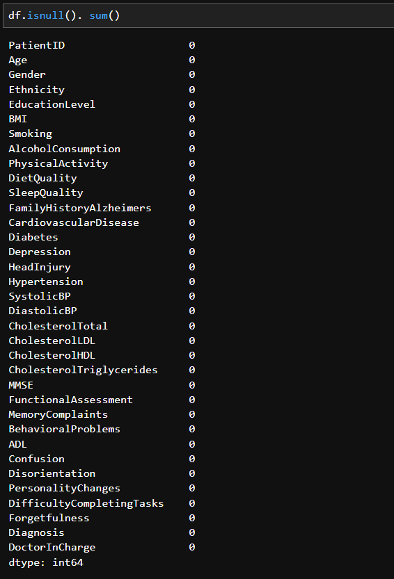
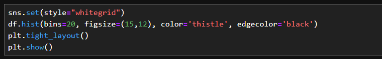

## Research Topic
•	What is the effectiveness of using the Random Forest Classifier for early prediction of Alzheimer's Disease compared to other machine learning models? 

•	Which features are most influential in predicting the development of Alzheimer's Disease?

## Chapter 1: Executive Summary
This project represents a significant step towards leveraging machine learning for proactive healthcare. 
This project has used the Random Forest Classifier to predict the likelihood of an individual developing Alzheimer's Disease in the future. Alzheimer's Disease is a progressive neurological disorder that impacts memory, thinking, and behaviour, and early prediction is crucial for intervention and management strategies. 
The model accuracy score is 91%, indicating that 91% of the total instances are correctly classified.

For future iterations aim to apply k-fold cross-validation and Grid Search techniques avoiding overfitting issues. Advanced ensemble boosting methods can also be combined with Random Forest to create a more robust model.

## Chapter 2: Literature Review

### 2.1 Machine Learning Algorithms
Machine learning (ML) algorithms are computational methods that enable machines to learn from data and make decisions or predictions based on that data. “A system that is in a changing environment should have the ability to learn” (Alpaydin, 2021). Hence machine learning is a form of artificial intelligence that evolves with learning outcomes.
Ensemble learning is one of the key supervised machine learning categories and “is primarily used to improve the performance of a model” (Mahesh, 2020). Within Ensembles gradient-boosting and random forest classification are two famous methods.

### 2.2 Why Random Forest Classifier
“Prediction in health sector requires greater degree of precision for improved diagnosis and treatment” (Singh et al., 2017)
Azar et al. 2014 claim that “random forest models provided greater predictive accuracy than single-tree models” and are specifically effective in healthcare.
Jackins et al. (2021) discuss that “Bayesian network classifier and random forest classifier are used to diagnose the risk for diabetes.. the outcome shows that Random Forest was performed well in both accuracy and ROC curve”.
Furthermore, “Standard decision tree classifiers have the disadvantage that they are prone to overfitting to the training set. The random forest's ensemble design allows the random forest to compensate for this and generalize well to unseen data” (Wood, n.d.).
Prediction power and model accuracy are the key measures in choosing an algorithm for the selected data set. Hence the random forest (RF) method has been identified as the optimal approach to predicting the machine learning outcome for Alzheimer's Disease.

## Chapter 3: Data Source and ETL Flow

The dataset used for this research was obtained from the Kaggle platform.

•	Path to Dataset: https://www.kaggle.com/datasets/rabieelkharoua/alzheimers-disease-dataset

•	DOI (Digital Object Identifier) Citation: Rabie El Kharoua. (2024). 🧠 Alzheimer's Disease Dataset 🧠 [Data set]. Kaggle. https://doi.org/10.34740/KAGGLE/DSV/8668279

### ETL Diagram

## Chapter 4: Data Analysis

### 4.1 Importing required Python Libraries

### 4.2 Loading CSV Data

* Used the pandas library to read a CSV (Comma-Separated Values) file and load its contents into a DataFrame defined as 'df'.

### 4.3 Understanding the Data

* shape - structure of data (rows, columns)
* head - reading the data (first 25 rows)
* dtypes - data type of each column
* describe - key statistics of each column
* isnull - checking for null values (completeness data dimension)

=========================================================================================
* The attribute shape from the pandas library is used to get the dimensions (number of rows and columns) of the DataFrame. The data set contains 35 columns and 2,149 rows.

* The head() function is also from the pandas library is used to display the first 15 rows of a DataFrame, allowing us to evaluate if the right data type is available for analysis.

This dataset contains personally identifiable information (PII). Complying with Art. 7 of the GDPR “the controller shall be able to demonstrate that the data subject has consented to processing of his or her personal data” (Intersoft Consulting, 2016).

However, this is a publicly available dummy data source used only to express learning outcomes. Hence data privacy conformity is not within the scope.

* Using the df.dtypes attribute returns a Series with the data type of each column in the DataFrame. This helps to understand correct type of data is stored in each column, which is crucial for data analysis and preprocessing tasks.

* ‘Describe’ function within the pandas' data frame “Displays the Descriptive Summary Statistics of the data when invoked” (Venkataramanan, 2021). np.transpose() function, imported from the NumPy library, is used to transpose the rows and columns of a matrix. incorporating with the output of df.describe() function, swaps the rows and columns, effectively rotating the descriptive statistics DataFrame.

  
#### Key Observations:

##### Patient Demographics:
* Age distribution is skewed towards older individuals (mean age around 75 years).
* Gender distribution is roughly balanced.

##### Health Indicators:
* Average BMI suggests a population with a range from normal to overweight/obese.
* Relatively low prevalence of smoking and physical activity.

##### Lifestyle Factors:
* Alcohol consumption and diet quality show wide variability.

##### Health Conditions:
* Low prevalence of chronic conditions like cardiovascular disease, diabetes, hypertension, and depression.

##### Blood Pressure and Cholesterol:
* Average blood pressure and cholesterol levels are within typical ranges but show substantial variation.

These statistical summaries provide insights into the dataset's composition, outliers and variability, helpful for further analysis or modeling.

* We have applied the isnull () function verifying the ‘Completeness’ data quality dimension, as “missing data will have an impact on its use and affect the reliability of insights” (GOV.UK, 2021).

### 4.4 Exploratory Data Analysis

The next stage of this analysis is to delve into comprehensive data patterns and relationships associated with the data.

Mendlem, S. (2023) claims that “Exploratory Data Analysis (EDA) serves as the compass that guides data scientists through the intricate terrain of datasets”. 

### Key Steps:

#### Check for Duplicates:
* Identify and remove any duplicate entries in the dataset to ensure data quality and accuracy.

#### Data Drop (Irrelevant Columns):
* We have used a subsetted data frame to drop non-essential columns and assign them to a new data frame. This provides code clarity for future maintenance and streamline the dataset to focus on relevant features.

#### Quick EDA with Sweetviz:
* Emerging open-source EDA libraries like ‘Sweetviz’ allow us to gain quick insights about data with minimal code. This will add "the edge to efficiency of your industrial ML and data analytics projects” (Vyshnya 2020). In contrast, when analyzing large datasets “readability and interpretation of the association graph becomes difficult” (Lekhwar 2020).

* Immediately, we can see there are no duplicates in our dataset. 19 columns are categorical and 16 are numerical.

* The Association Matrix below explains the numerical correlations. Functional Assessment and ADL briefly show a strong correlation. We’ll verify this with Seaborn Heatmap at a later stage.

#### Plot the Distribution of Numerical Features:

* Below code configures the plot style with Seaborn library, creates histograms for all columns in the DataFrame (df) with specified aesthetics, adjusts the layout to prevent overlap, and finally displays the plot.

* Each histogram tells a story. Overall most of the features have a uniform distribution suggesting a balanced dataset across those variables.

#### Identifying Key Features for Diagnosis:
* Determine which features are most relevant and influential in diagnosing conditions or predicting outcomes to improve model performance and interpretability.

#### Univariate Analysis:
* Perform a detailed analysis of each individual variable to understand its distribution, central tendency, variability, and potential impact on the target variable.
  
These steps aim to prepare and understand the dataset thoroughly before moving on to more complex analyses or model building.
