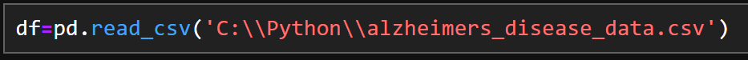

# Predicting Alzheimer's Disease with Machine Learning

## Research Topic
•	What is the effectiveness of using the Random Forest Classifier for early prediction of Alzheimer's Disease compared to other machine learning models? 

•	Which features are most influential in predicting the development of Alzheimer's Disease?

## Chapter 1: Executive Summary
This project represents a significant step towards leveraging machine learning for proactive healthcare. 
This project has used the Random Forest Classifier to predict the likelihood of an individual developing Alzheimer's Disease in the future. Alzheimer's Disease is a progressive neurological disorder that impacts memory, thinking, and behaviour, and early prediction is crucial for intervention and management strategies. 
The model accuracy score is 91%, indicating that 91% of the total instances are correctly classified.

For future iterations aim to apply k-fold cross-validation and Grid Search techniques avoiding overfitting issues. Advanced ensemble boosting methods can also be combined with Random Forest to create a more robust model.

## Chapter 2: Literature Review

### 2.1 Machine Learning Algorithms
Machine learning (ML) algorithms are computational methods that enable machines to learn from data and make decisions or predictions based on that data. “A system that is in a changing environment should have the ability to learn” (Alpaydin, 2021). Hence machine learning is a form of artificial intelligence that evolves with learning outcomes.
Ensemble learning is one of the key supervised machine learning categories and “is primarily used to improve the performance of a model” (Mahesh, 2020). Within Ensembles gradient-boosting and random forest classification are two famous methods.

### 2.2 Why Random Forest Classifier
“Prediction in health sector requires greater degree of precision for improved diagnosis and treatment” (Singh et al., 2017)
Azar et al. 2014 claim that “random forest models provided greater predictive accuracy than single-tree models” and are specifically effective in healthcare.
Jackins et al. (2021) discuss that “Bayesian network classifier and random forest classifier are used to diagnose the risk for diabetes.. the outcome shows that Random Forest was performed well in both accuracy and ROC curve”.
Furthermore, “Standard decision tree classifiers have the disadvantage that they are prone to overfitting to the training set. The random forest's ensemble design allows the random forest to compensate for this and generalize well to unseen data” (Wood, n.d.).
Prediction power and model accuracy are the key measures in choosing an algorithm for the selected data set. Hence the random forest (RF) method has been identified as the optimal approach to predicting the machine learning outcome for Alzheimer's Disease.

## Chapter 3: Data Source and ETL Flow

The dataset used for this research was obtained from the Kaggle platform.

•	Path to Dataset: https://www.kaggle.com/datasets/rabieelkharoua/alzheimers-disease-dataset

•	DOI (Digital Object Identifier) Citation: Rabie El Kharoua. (2024). 🧠 Alzheimer's Disease Dataset 🧠 [Data set]. Kaggle. https://doi.org/10.34740/KAGGLE/DSV/8668279

### ETL Diagram

## Chapter 4: Data Analysis

### 4.1 Importing required Python Libraries

### 4.2 Loading CSV Data

* Used the pandas library to read a CSV (Comma-Separated Values) file and load its contents into a DataFrame defined as 'df'.

### 4.3 Understanding the Data

* shape - structure of data (rows, columns)
* head - reading the data (first 25 rows)
* dtypes - data type of each column
* describe - key statistics of each column
* isnull - checking for null values (completeness data dimension)

============================================================================================
* The attribute shape from the pandas library is used to get the dimensions (number of rows and columns) of the DataFrame. The data set contains 35 columns and 2,149 rows.

* The head() function is also from the pandas library is used to display the first 15 rows of a DataFrame, allowing us to evaluate if the right data type is available for analysis.

This dataset contains personally identifiable information (PII). Complying with Art. 7 of the GDPR “the controller shall be able to demonstrate that the data subject has consented to processing of his or her personal data” (Intersoft Consulting, 2016).

However, this is a publicly available dummy data source used only to express learning outcomes. Hence data privacy conformity is not within the scope.

* Using the df.dtypes attribute returns a Series with the data type of each column in the DataFrame. This helps to understand correct type of data is stored in each column, which is crucial for data analysis and preprocessing tasks.

